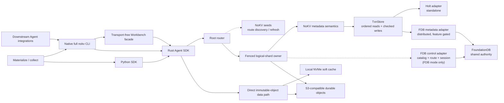
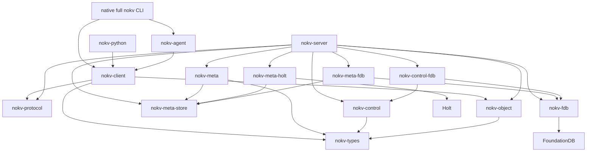
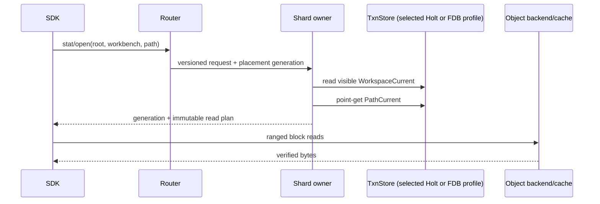
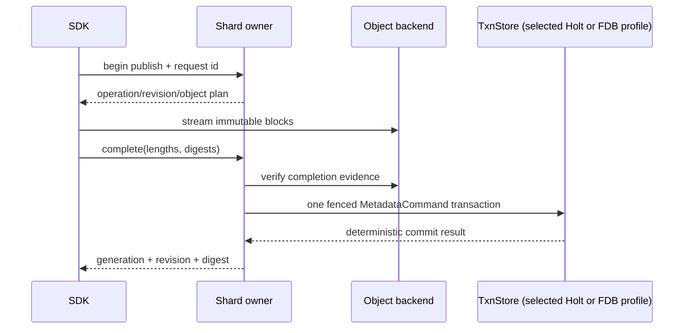
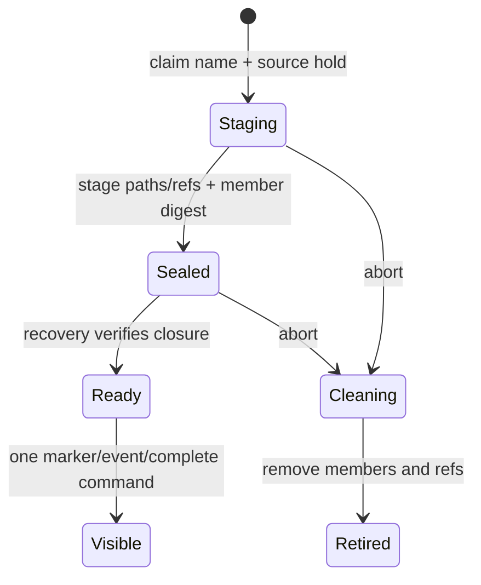

<!--
Copyright 2024-2026 The NoKV Authors.
SPDX-License-Identifier: Apache-2.0
-->

# Architecture

Status: normative workspace architecture.

## System Shape



The metadata and object paths are separate. Small control and namespace records
go through the shard owner. Clients stream immutable blocks directly through
the object boundary after receiving a revision/upload plan. Exactly one
metadata adapter is selected by the explicit metadata URL: standalone Holt has
no distributed control plane, while distributed FDB keeps control and metadata
records in the same shared authority. There is no provider auto-selection,
migration, fallback, or dual-write path.

FUSE, POSIX, CSI, and fsspec are not architecture layers.

## Package Direction



Arrows point from a consumer to its dependency. The
[code contract](./development/code_contract.md) is normative.

Key constraints:

- types and protocol are storage-neutral;
- metadata owns durable semantics, logical keyspaces, and record codecs;
- the Holt adapter owns the standalone physical mapping and local durability;
- the feature-gated FDB metadata and control adapters share the process-global
  `nokv-fdb` runtime but retain separate domain ownership;
- the server selects exactly one metadata runtime from an explicit URL;
- control owns root placement and owner fencing, not path semantics;
- object owns provider I/O, not reachability;
- client uses protocol/routing and never imports meta/server;
- Agent adapters shape tools over SDK traits and remain transport-free;
- the native full CLI is the primary integration surface;
- the Python SDK is the secondary embedded surface.

## Identity And Namespace

```text
RootPlacement(root_id)                    control-plane truth
RootFence(root_id)                        installed shard-local fence

WorkspaceCurrent(root_id, workbench_id)
  -> incarnation, revision, lifecycle

WorkspaceIncarnationClaim(root_id, incarnation)
  -> stable workbench_id; permanent and never reused

PathCurrent(root_id, incarnation, path)
  -> generation, immutable revision, body/manifest digests, size,
     dependency bounds, content type, typed projection
```

`PathCurrent` is the only namespace truth. Workbench names are separated from
path keys by a never-reused incarnation. This prevents a failed restore or
retired Workbench's rows from appearing under a later claim.

Paths are exact case-sensitive UTF-8. The physical codec adds one to each UTF-8
byte, separates components with NUL, and ends an exact key with marker `0x01`.
This reserves both markers, places a child's delimiter rollup before its exact
artifact and both before longer siblings, and prevents an exact key from being
a strict prefix of another valid path key. The same normalizer/codec owns
storage keys, request identities, index identities, and restore member ids.
System format version 9 retains and gates this layout.

Directories are implicit. The Workbench root and five standard sections are
virtual. A file stat is a point read; an implicit-directory stat is a prefix
existence check.

See [Metadata Schema](./metadata-schema.md) for byte-level and state-machine
rules.

## Read Path



A valid cached Workbench marker can avoid its routing/lookup work, but the
client still uses generation/version validation. The authoritative artifact
lookup is one exact schema key and does not follow the revision-lifetime row.
The current portable read path first captures owner, root-fence, and commit
clock state. Each dependent marker or path point read then batches those three
guards with its data key in one `TxnStore::read` call. This costs eleven point
reads for an uncached live exact get, but it does not rely on a backend-specific
snapshot session. A later declarative batch API can remove the repeated guards
without weakening owner fencing.

A direct-child list replaces the path lookup with one ordered prefix-scan path.
Its common-prefix rollups become implicit-prefix page items. A recursive list
uses the same prefix without delimiter rollup. Each physical
page batches its owner, root-fence, and commit-clock guards with a bounded store
scan. One protocol page may use multiple scans of at most 255 logical items
each when its requested limit is larger. The metadata listing may merge an
exact-prefix point read only after descendant EOF, while the Workbench adapter
exposes only direct children and drops that self row.
There is no per-entry metadata fanout. The returned cursor is bound to the
workbench scope, read view, continuation fence, and child anchor. Snapshot
continuations retain one exact root read version. Live continuations may move
to a newer root read version only while the target workspace incarnation and
revision remain unchanged; target drift fails closed, and an initial bounded
collection may restart in full but never merges workspace revisions. This
contract is gated by operation schema `nokv.workspace.rpc.v10`; v7 added the
exact read-version fence used by path point reads, v8 added the required typed
`Prefix`/`Exact` catalog path match so an artifact cannot inherit fields from
same-name descendants, v9 added an explicit query profile plus tagged query
rows and authoritative search, aggregate, and catalog totals/facets, and v10
separates seed discovery from root-routed workspace requests. V3 first
added the provider-neutral object namespace identity to every root route.

Each TCP connection starts with the fixed-width, schema-neutral transport
handshake v1. The client offers one exact operation schema, and the server
accepts only `nokv.workspace.rpc.v10`; the handshake version remains stable when
the operation schema changes. For upgrade diagnostics, the server recognizes
only operation-first envelopes from the public v2 client and the post-tag v3
client. It parses a bounded route/request header, ignores the operation, emits
one schema-readable failure, and closes without dispatch. The v2 client gets
its exact v2 failure envelope; the v3 client gets a v10 failure envelope so its
decoder reports the v10/v3 schema mismatch. Unknown legacy schemas, malformed
envelopes, and malformed handshakes fail closed. This is a read-only rejection
path, not a legacy response decoder or operation fallback.

Secondary-index queries run at one read version and filter every result by the
matching visible incarnation. `ArtifactV1` remains the default Workbench query
contract. `GenericNamespaceV1` carries a bounded, normalized, display-only
presentation root and materializes Workbench, section, implicit-directory, and
artifact rows at that same read version. Its transient `path` scalar is the full
presentation path, while row identity stays the canonical Workbench and relative
path. An exact artifact wins over a same-name virtual directory without hiding
descendants. Its cursor binds the profile, presentation root, storage root, read
version, and query. Presentation paths are never persisted as metadata or used
as storage authority.
The generic catalog exposes the seven legacy built-ins plus declared durable
custom indexes. Custom-index registration builds an immutable, paged generation
behind one current-pointer CAS; rows retain ordered duplicate values and exact
directory or artifact-revision binding. Commit, snapshot, restore, retirement,
and reference GC carry the same sealed generation closure, so a dirty snapshot
can be restored without an intervening commit and an old generation cannot be
reused after reclamation. Object bodies are read only when the selected tool
actually requires them.

## Publish Path



The command validates schema, root fence, the selected provider's exact owner
predicate, request id, workspace/path generations, and revision reference state
before applying any mutation. In FDB mode the stable-session predicate is part
of the same physical transaction. The command atomically publishes:

- the revision and block manifest;
- the new path and workspace revision;
- strong-reference changes;
- secondary indexes;
- one typed event;
- GC candidacy for a replaced revision;
- the deterministic replay result.

Failed uploads never become visible. Response loss after commit returns the
same result on retry. Generic random writes are absent; append is immutable
segment publication plus stream-head CAS.

Commit replay resolves its deterministic build-operation identity before any
live workspace lookup. A terminal retry authenticates the complete stored
request and commit-owned run-manifest binding, then verifies the corresponding
durable publish-operation result. Consequently a later replacement head cannot
change the result of retrying an older exact commit.

The durable request also stores a domain-separated digest of every caller-known
run-manifest projection input except the owner-supplied commit time. Recovery
checks that digest before rebuilding or publishing a manifest, including while
the commit is still Running and has no staged-manifest binding.

## Revision Ownership

```text
nokv/artifacts/{logical_shard_id}/{root_id}/{artifact_revision_id}/blocks/{object_index}
```

Revision ids never name a physical owner. A process owner may change while
logical-shard/root/revision identity stays stable.

Every current path and durable commit has an exact `RevisionRef`. A revision
that reuses older blocks has a sealed dependency reference to each distinct
owner revision. The child revision stores a strong-reference count and epoch:

```text
reference add/remove
  -> mutate RevisionRef
  -> update count
  -> increment epoch
  -> if count == 0, create candidate(epoch, last_zero_version)
```

GC claims only the current zero-count epoch and atomically moves the revision
from `Available` to `Deleting`. New references require `Available`, closing the
restore/commit-versus-delete race.

## Snapshot And Commit Reads

NoKV's logical history and hold records support two different products:

- a leased snapshot creates a `HistoryHold(read_version)`;
- a durable commit scans under a temporary `HistoryHold`, writes an ordered
  tree manifest, adds exact commit revision refs, verifies closure seals, then
  releases the history hold.

The snapshot reaper and renew operation race through one durable lifecycle CAS.
Once `ReapClaimed` wins, the history hold is gone and renewal fails.

`TxnStore` supplies a consistent snapshot for each read batch. `MetaShard`
reconstructs historical state across bounded batches and restarts if the
domain commit clock changes. NoKV does not expose a retained Holt view as a
snapshot or commit contract.

Commits do not pin global history. Tags are CAS-protected names for commits.
Commit retirement is explicit and checks all heads, tags, leases, lineage
children, and restore/fork consumers.

## Restore

Restore uses an operation-owned fresh Workbench incarnation:



Staged paths have strong references but no visible marker. Root-wide query and
watch surfaces therefore cannot leak them. The final command verifies the exact
incarnation and member seal, publishes it, completes the operation, emits one
event, and releases the source hold.

Restore copies O(entries) metadata and zero object bytes inside one root/shard.
NoKV deliberately avoids a lazy overlay that would tax every later read/list.

## Sharding And Ownership

The selected serving runtime fixes placement before a root's first write:

```text
RootId -> immutable LogicalShardId
LogicalShardId -> current owner identity and fencing generation
```

Standalone Holt derives one local logical shard and installs its local
`RootFence` without a distributed catalog or lease service. Distributed FDB
persists the root/shard catalog, route, and exact owner session before serving.
The owner validates `RootFence` and its provider-specific ownership predicate in
the same physical transaction as each metadata commit. Placement is never
inferred from a path or modulo the number of owners.

A hot root's logical shard may be assigned to a dedicated physical process.
That is owner movement, not a change to logical shard or object keys.

One root is not split across logical shards. Cross-shard operations fail before
partial work.

## Recovery And Durability

Each metadata URL names one acknowledgement and recovery authority:

```text
holt:///absolute/path
  ACK after the exclusive Holt store commits its local journal
  restart by reopening that same exact store

fdb:///absolute/fdb.cluster?prefix=NAME
  ACK after the shared FDB transaction commits
  fail over through an exact FDB owner session and metadata fence
```

Holt has no control plane and does not claim copied-directory or replacement
host recovery. FDB stores the manifest, catalog, route, session, heartbeat, and
workspace metadata in one shared authority. A stale FDB owner must satisfy its
stable-session predicate in the same physical transaction as every metadata
commit.

Clients never open either metadata store. They use one or more NoKV seeds to
discover the current owner and accept only monotonic route/session generations.

Lifecycle recovery is driven by durable metadata ledgers, not object listing.
This covers staged uploads, commit construction, restore staging and cleanup,
snapshot retirement, and GC claims. An ambiguous destructive provider outcome
is quarantined. The retired distributed-local-log publication path is not a
third profile or a compatibility fallback.

The FDB runtime is feature gated and remains **NOT QUALIFIED** until its real
conformance, unknown-outcome, takeover, crash, seed-discovery, lifecycle,
transaction-limit, and performance gates have retained evidence. Source wiring
or unit tests alone cannot change that status.

## Architecture Acceptance

The architecture is accepted as one system, not as independent storage
experiments. The required evidence covers:

1. namespace point reads, delimiter scans, conflict handling, and command
   amplification across the declared workload matrix;
2. revision-owned publication, visibility, lifecycle, references, GC, and
   recovery;
3. protocol, server, native CLI, Python and Rust SDKs,
   control routing, and lifecycle workers on
   the same schema and identity model;
4. owner failover, checkpoint/log recovery, ambiguous provider outcomes, and
   live Workbench workflows;
5. the complete [acceptance plan](./development/workspace-acceptance.md),
   with each applicable gate reported as `PASS`, `FAIL`, or `NOT QUALIFIED`.
